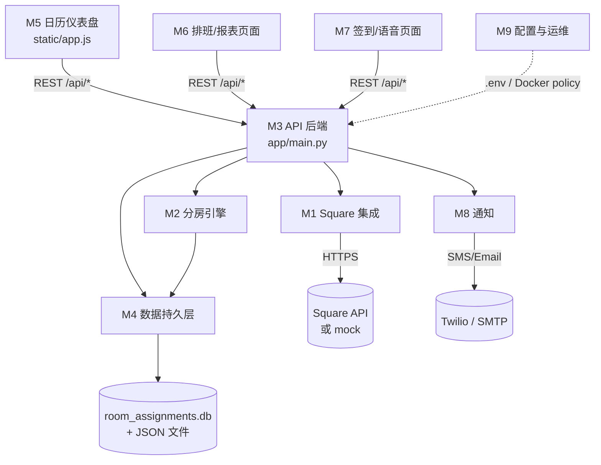

# 概要设计（High-Level Design）— MoM Room Management (Jaelyn)

> 依据：`doc/proposal.md`。目标：划分模块、说明模块间关系。
> 详细实现见 `doc/detailed-design.md`；任务拆分见 `doc/tasks/`。

## 1. 技术栈

| 层 | 技术 |
|----|------|
| 后端 | Python + FastAPI + Uvicorn（端口 8001） |
| 前端 | 原生 HTML / CSS / JS（无构建），`static/` 目录 |
| 数据 | SQLite（`room_assignments.db`，SQLAlchemy ORM）+ 少量 JSON 文件 |
| 外部 | Square API（预约）、Twilio（短信）、SMTP（邮件） |
| 运维 | Docker + docker-compose（restart/healthcheck/资源/日志 policy） |

## 2. 模块划分

| # | 模块 | 主要文件 | 职责一句话 |
|---|------|----------|-----------|
| M1 | Square 集成 | `app/square_service.py`, `square_client.py`, `app/mock_square.py` | 拉取/富化 Square 预约；无凭据时提供 mock |
| M2 | 分房引擎 | `app/room_assigner.py`, `app/room_occupancy.py`, `app/unassigned_suggestions.py` | 自动分房、占用计算、无房修复建议 |
| M3 | API 后端 | `app/main.py`, `app/schemas.py` | 全部 REST 接口；组装"一天"数据；覆盖信息写入 |
| M4 | 数据持久层 | `app/models.py`, `app/database.py`, `app/roster_store.py` | ORM 表、迁移、roster JSON 存储 |
| M5 | 前端-日历仪表盘 | `static/index.html`, `app.js`, `style.css`, `i18n.js` | 主日历、房间/技师/小费/签到操作 |
| M6 | 前端-排班与报表 | `masseuse_scheduling_sheet.*`, `grid.html`, `reports.html`, `services.html`, `customers_hours_report.html` | 排班表、工资网格、报表、费率编辑 |
| M7 | 前端-辅助页面 | `checkin.html`, `voice_book.html`, `glossary_en_zh.html` | 签到 kiosk、语音预约、术语表 |
| M8 | 通知 | `app/notifications.py` | 无房间时短信 + 邮件告警 |
| M9 | 配置与运维 | `config.py`, `.env`, `Dockerfile`, `docker-compose.yml`, `start_server_jaelyn.bat` | 环境配置、启动、容器化管控 |
| M10 | 情侣第二技师自动挡位（新，未实现） | 计划：`app/couple_autoblock.py` | 轮询发现情侣按摩 → 自动在 Square 为第二技师挡时间；替代人工与老 webhook 程序 |

## 3. 模块关系图

## 4. 核心数据流（看一天日历）

1. 前端 `GET /api/day?date=...`（M5 → M3）
2. M3 经 M1 拉当天 Square 预约（无凭据 → mock）
3. M3 从 M4 合并覆盖信息（技师改派、时长调整、取消隐藏、房间锁…）
4. M2 对无经理锁定的预约自动分房，结果写回 M4
5. 分不出房 → M2 生成修复建议，M3 触发 M8 告警（带冷却）
6. M3 组装 `DayResponse` 返回，前端渲染日历

## 5. 关键设计决策

- **两个真相源分离**：Square 只读为主（语音预约除外）；房间与前台覆盖只存本地
- **经理优先**：`assigned_by='manager'` 的记录自动分房永不覆盖
- **无凭据可运行**：`mock_square.py` 与真实 service 同接口，便于开发演示
- **前端零构建**：直接改 JS 刷新即可，符合前台电脑环境
- **运维用 policy 声明式管控**：restart / healthcheck / 资源限制 / 日志轮转写在 compose 里

## 6. M10 情侣第二技师自动挡位（概要，待方案确认）

- 作为 8001 服务器内的**后台轮询任务**运行（店内服务器无公网地址，不用 webhook；老程序的 webhook/轮询独立进程模式废弃）
- 数据流：轮询 Square 未来 N 天预约 → 识别情侣按摩且无挡位记录 → 选空闲第二技师 → 写入 Square 挡位 → 映射存 SQLite 新表 `couple_second_blocks` → 主预约取消/改期时联动
- 写入 Square 的方式二选一（proposal 3.5 节）：A 占位预约（Bookings API）或 B Google Calendar 同步 personal event
- 安全机制：挡位带 `AUTO-BLOCK:` 标记防递归；上线前提供 dry-run 模式（只记录不写入）
