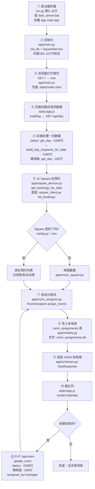
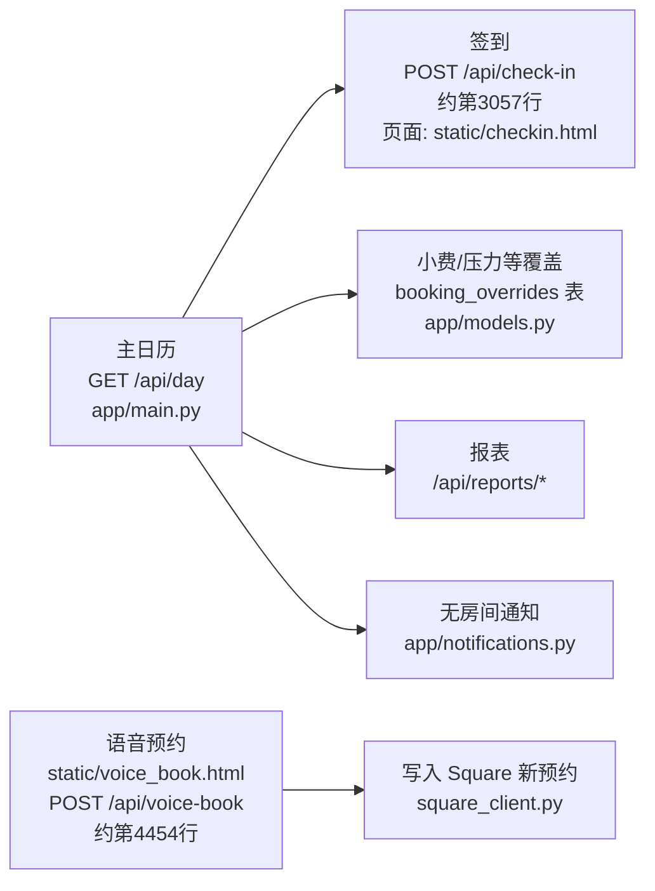

# Massage on Main — 房间管理系统：全局说明

> 写给没有编程背景、需要接手项目的人。  
> **推荐阅读方式：** 在 Cursor 里打开本文件 → 右键或用预览（Markdown Preview）查看；流程图会显示为图。  
> **为什么用 `.md` 而不是 PPT：** 见文末「为什么不用 PPT」。

---

## 0. 你电脑上两个文件夹是什么关系？

| 文件夹 | 角色 | 一句话 |
|--------|------|--------|
| `MoM_Room_Jaelyn` | **当前完整版**（分支 `mark-v`，测试用） | 分房间 + 签到 + 小费 + 报表 + 语音预约等 |
| `MoM_Room_Management` | **较旧/精简版**（分支 `main`） | 主要只有：看一天日程 + 自动/手动分房间 |

两者是**同一产品线**的不同版本。学功能、日常跑测试 → 优先看 **Jaelyn**。  
本文以完整版为主；精简版 = 同一条「主流程」的子集。

---

## 1. 这个项目到底干什么？（一句话）

客人在 **Square（预约系统）** 里约按摩。  
这个软件**不替代 Square 约客**，核心只做一件事：

> **给每个预约分配物理房间**（房间 0–6，以及情侣合并房 `02D`），并在浏览器日历上显示；经理还能手改房间。

完整版额外做：签到、小费、技师覆盖、工资费率、报表、没房间时发短信/邮件、语音预约等。

### 两个「真相」

| 系统 | 负责什么 |
|------|----------|
| **Square** | 预约本身（谁、几点、哪个技师、什么服务） |
| **本软件 + 本地数据库** | 房间分配结果（这个预约用哪间房） |

---

## 2. 用生活语言理解整体结构

```text
客人约在 Square
        ↓
前台打开网页 http://127.0.0.1:8000
        ↓
服务器从 Square 拉当天预约
        ↓
本地规则自动分房间，结果存进电脑上的小数据库
        ↓
日历显示；经理可手改房间
```

### 关键文件角色（先记住这些就够）

| 角色 | 文件 |
|------|------|
| 怎么启动 | `run.py` 或 `start_server.bat` / `start_server.ps1` |
| 网页后端（所有接口） | `app/main.py` |
| 从 Square 取预约 | `app/square_service.py` + `square_client.py` |
| 自动分房规则 | `app/room_assigner.py` |
| 本地数据库表定义 | `app/models.py` + `app/database.py` |
| 网页界面 | `static/index.html` + `static/app.js` |
| 密钥配置 | `.env`（模板：`env.example`，由 `config.py` 读取） |
| 数据库文件 | 项目根目录 `room_assignments.db` |

---

## 3. 主流程图（每一步都有文件引用）

日常最常用路径：**打开仪表盘 → 看某一天 → 自动分房 → 可选手改**。



---

## 4. 主逻辑逐步说明

### 步骤 ①–②：启动与配置

- 运行后，Python 用 **FastAPI** 在本机 **8000** 端口开一个网站。
- 密钥写在 `.env`（例如 `SQUARE_ACCESS_TOKEN`），由 `config.py` 读入。
- **没配 Square** → 自动用 `app/mock_square.py` 假数据，仍能打开页面练习。
- 改完 `.env` 必须**重启服务器**才生效。

**参考：**

- 启动：`run.py`（约第 5–11 行）或 `start_server.bat`
- 初始化库与 Square：`app/main.py`（加载时调用 `init_db()`、创建 `SquareService()`）
- 配置说明：`readme_jaelyn.md`、`env.example`

### 步骤 ③–④：打开网页并要「某一天」的数据

- 浏览器访问：`http://127.0.0.1:8000/`
- 页面是 `static/index.html`，逻辑在 `static/app.js`
- 页面会请求：`GET /api/day?date=YYYY-MM-DD`

**参考：**

- 首页路由：`app/main.py` 里的 `root`（返回 `index.html`）
- 前端拉数据：`static/app.js` 里的 `loadDay`

### 步骤 ⑤–⑥：从 Square 拉预约（只读）

- `app/square_service.py`：把 Square 原始数据转成页面能懂的格式  
  （客人、技师、服务名、开始/结束时间、单人还是情侣）
- `square_client.py`：真正跟 Square 服务器通信（官方 SDK）
- 取消 / no-show 的预约会被丢掉，不参与分房

**参考：**

- `SquareService.get_bookings_for_date` → `app/square_service.py`
- `SquareBookingsClient.list_bookings` → `square_client.py`

### 步骤 ⑦：自动分房（核心业务规则）

文件：`app/room_assigner.py`，类：`RoomAssigner`，方法：`assign_rooms`

| 预约类型 | 优先顺序（代码里的常量） |
|----------|--------------------------|
| 情侣 `COUPLE_PRIORITY` | 5 → 6 → `02D`（0+2 合并成一间） |
| 单人 `SINGLE_PRIORITY` | 1 → 3 → 4 → 2 → 0 → 6 → 5 |

规则要点：

1. **经理手改过的不覆盖**（数据库里 `assigned_by == 'manager'`）
2. 按时间「占坑」：某房间某时段已被占，就试下一个优先级
3. 选了 `02D` 会同时占住房间 **0 和 2**
4. 全分不出 → 标成 `UNASSIGNED`（完整版还可发通知，见下文）

**参考：**

- 优先级常量：`app/room_assigner.py` 约第 12–20 行
- 主算法：`assign_rooms`（同文件）
- 找空房：`_find_available_room`
- 标记占用：`_mark_room_busy`（含 `02D` 占 0+2）

### 步骤 ⑧–⑨：存进本地库，再返回给网页

- 只记：「这个 Square 预约 ID → 用了哪个房间」
- 表：`room_assignments`（定义在 `app/models.py` 的 `RoomAssignment`）
- 文件：`room_assignments.db`（SQLite，就在项目文件夹里）
- 返回结构：`app/schemas.py` 里的 `DayResponse` / `Event`

### 步骤 ⑩–⑪：画日历；经理可手改

1. 前端 `renderCalendar` 画出技师 × 时间的格子（`static/app.js`）
2. 点房间徽章 → 选新房间 → 发 `PUT /api/room`
3. 后端 `update_room` 写成 `assigned_by = 'manager'`，再重新跑自动分房（会尊重手改）

**参考：**

- Jaelyn：`update_room` 约在 `app/main.py` 第 2286 行
- 精简版：`update_room` 约在 `app/main.py` 第 294 行

---

## 5. 完整版（Jaelyn）多出来的功能（支线）

这些不是「分房间」主线，但日常运营会用到。



| 功能 | 入口 / 文件 |
|------|-------------|
| 签到 | `POST /api/check-in`（`app/main.py` ~3057）；页面 `static/checkin.html` |
| 语音预约 | `POST /api/voice-book`（~4454）；页面 `static/voice_book.html` |
| 报表 | `static/reports.html` + `/api/reports/...` |
| 服务/工资费率 | `static/services.html` + `/api/services` |
| 没房间发短信/邮件 | `app/notifications.py`（需 Twilio / SMTP 配置） |
| 技师名单覆盖 | `app/roster_store.py` + `roster_overrides.json` |

---

## 6. 另一条老逻辑：情侣按摩「占第二个技师」（不是分房间）

Square 里情侣按摩常常只约一个技师；旧代码会尝试**在 Square 里再挡第二个技师的时间**。

| 文件 | 作用 |
|------|------|
| `main.py` | 启动 webhook 服务（不是仪表盘） |
| `webhook_handler.py` | 接收 Square 的 `/webhook` |
| `booking_sync.py` | `BookingSync.process_new_booking` 等，创建挡时间 |
| `polling_mode.py` | 不用 webhook 时，轮询 Square |

这和仪表盘的「分物理房间」是**两条线**。日常开 `8000` 端口的日历，一般**不会**自动跑这条线。

---

## 7. 技术栈（知道名字即可）

| 层 | 用什么 |
|----|--------|
| 后端 | Python + FastAPI + Uvicorn |
| 前端 | 普通网页：HTML / CSS / JavaScript（没有 React） |
| 数据库 | SQLite 文件 `room_assignments.db` |
| 外部 | Square API；完整版还可接 Twilio（短信）、SMTP（邮件） |
| 依赖列表 | `requirements.txt` |

---

## 8. 本地数据库里主要记什么？（完整版）

库文件：`room_assignments.db`  
表定义：`app/models.py`；创建/迁移：`app/database.py` 的 `init_db()`

常见表（名字看懂意思即可）：

| 表 | 记什么 |
|----|--------|
| `room_assignments` | 每个预约分到哪间房 |
| `room_assignment_undo` | 改房间后的撤销 |
| `booking_overrides` | 签到、小费、技师覆盖等前台覆盖信息 |
| `service_pay_rates` | 服务对应工资费率 |
| `no_room_notification_sent` | 已经发过「没房间」通知，避免重复发 |
| `customer_hours_daily_snapshots` | 报表用的客户工时快照 |

---

## 9. 你每天真正需要做的事

1. 确认 `.env` 里 Square 配置正确（或接受用假数据）。
2. 双击 `start_server.bat`（或运行 `python run.py`）。
3. 浏览器打开 `http://127.0.0.1:8000/`。
4. 选日期 → 看房间是否合理 → 需要时点徽章手改。

出问题先查：

- 服务器窗口有没有报错
- `.env` 是否配好、改完是否重启
- 是不是开错了文件夹（Jaelyn vs Management）

---

## 10. 建议你怎么学（顺序）

1. 先跑起来，点一天日历（建立直觉）。
2. 再读本文第 3 节流程图。
3. 打开 `app/room_assigner.py` 顶部的优先级列表（约 12–20 行）——这是业务规则，不一定要会写代码。
4. 需要改「谁出现在日历上」时，再看 `app/main.py` 里的技师过滤 / `roster_store.py`。
5. 需要对接 Square 密钥时，对照 `readme_jaelyn.md` + `env.example`。

---

## 附录：为什么用 Markdown（`.md`），而不是 PPT？

| 格式 | 适不适合你现在这个需求 |
|------|------------------------|
| **Markdown（`.md`）✅ 推荐** | 能放流程图（Mermaid）、精确写「哪个文件哪一步」、以后改一版就更新、在 Cursor / GitHub 都能看 |
| **PPT** | 适合开会口述、一页一页讲；但流程图和「文件:行号」引用不好维护，改代码后幻灯片很容易过期 |
| **Word / PDF** | 适合打印签字；对「带着代码引用持续更新」也不如 `.md` 方便 |
| **HTML 单页** | 双击用浏览器打开很友好；若你更想「双击就能看图」，可以再说，我可以再导出一版 |

**结论：**  
要**长期看懂、对着代码学** → 用本文件这种 `.md`。  
若某次要**给别人开会讲 10 分钟** → 可以再根据本文做几页 PPT，内容仍以本文为准。

---

## 附录：精简版（MoM_Room_Management）对应位置

| 步骤 | 文件位置（精简版） |
|------|-------------------|
| 启动 | `run.py` |
| 状态 | `GET /api/status` → `get_status`（`app/main.py` ~157） |
| 一天数据 | `GET /api/day` → `get_day`（~182） |
| 改房间 | `PUT /api/room` → `update_room`（~294） |
| 分房算法 | 同样是 `app/room_assigner.py` |
| 前端 | 同样是 `static/index.html` + `static/app.js` |

精简版**没有**完整版那一大套签到/报表/语音等路由。

---

*文档生成说明：内容对应仓库当前结构；行号是近似位置，若代码大改，以函数名（如 `get_day`、`assign_rooms`）为准搜索即可。*
